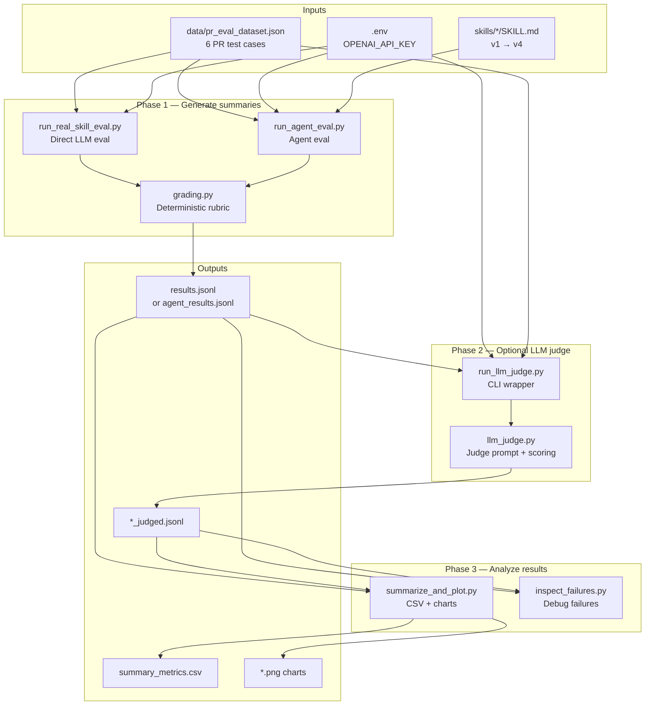
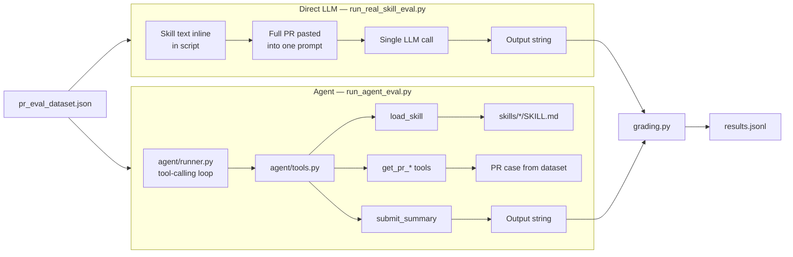
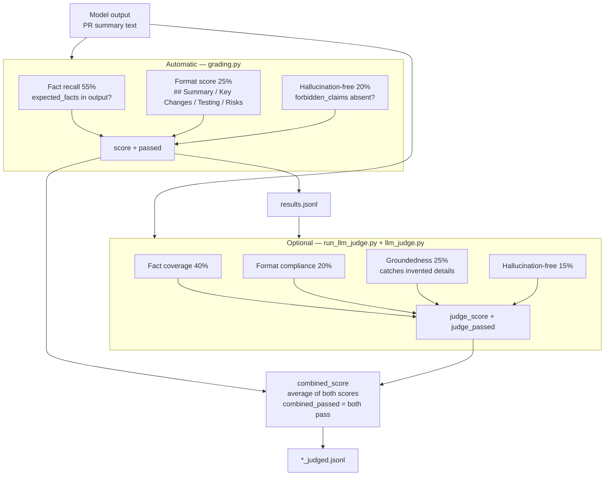
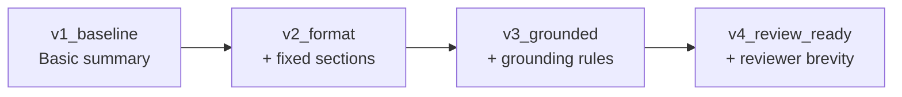
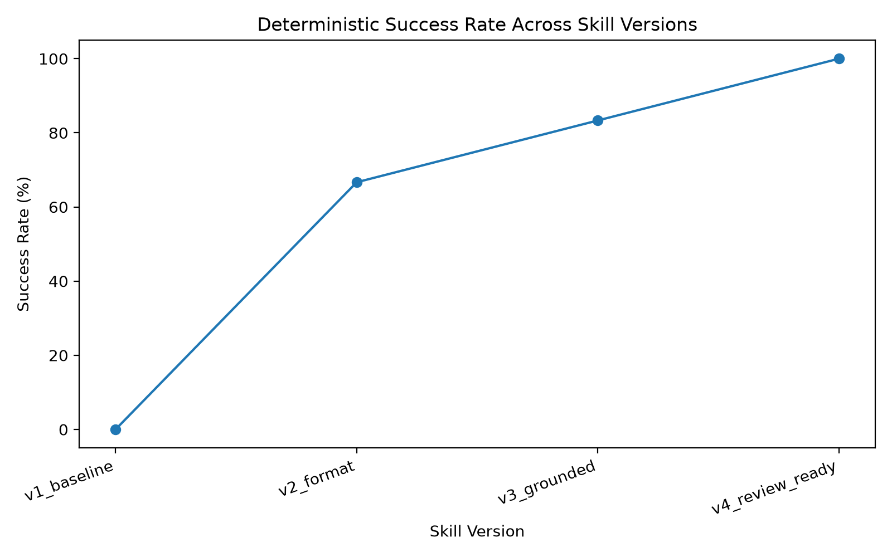
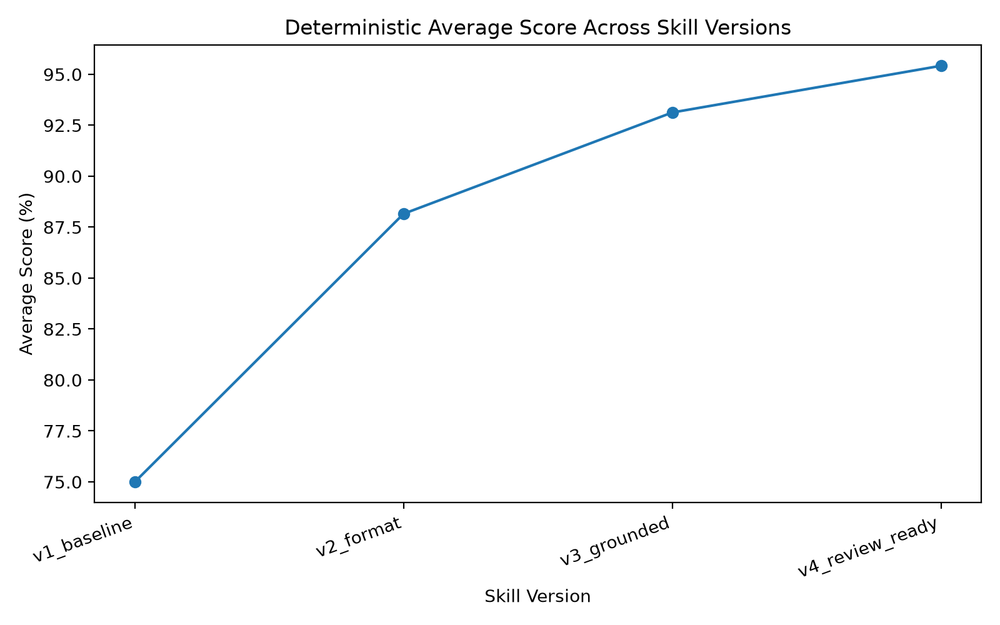
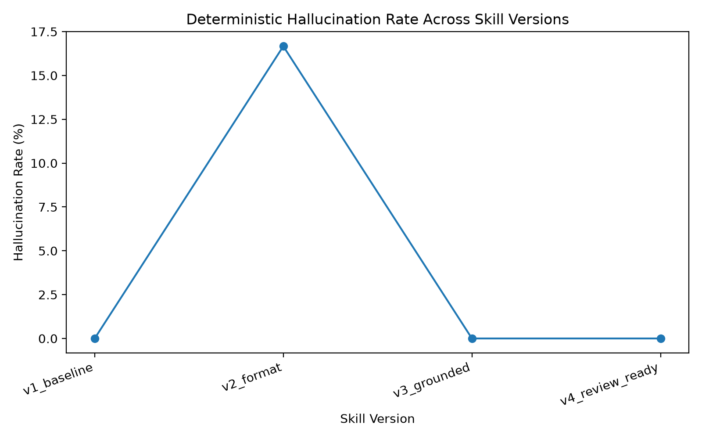
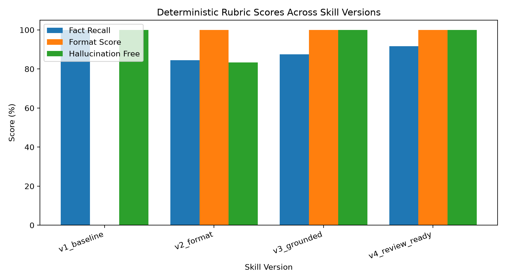

# Skill Evals with Agent Harness

Measure how PR-summary **skills** improve over time — using a real **agent harness** that loads skills from disk, fetches PR details via tools, and submits structured outputs.

Run the same dataset through four skill versions (`v1_baseline` → `v4_review_ready`), score with a deterministic rubric, and optionally add an LLM judge. Two eval paths:

| Mode | Script | What it tests |
|------|--------|---------------|
| **Skill eval (baseline)** | `run_real_skill_eval.py` | Skill instructions pasted into a single LLM prompt |
| **Skill eval (agent harness)** | `run_agent_eval.py` | Agent loads `skills/*/SKILL.md` and gathers PR data via tool calls |

## Architecture

### End-to-end pipeline



### Eval modes — how summaries are generated



### Scoring — deterministic vs LLM judge



### Skill version progression



Each eval run tests **all 4 skill versions × 6 PR cases = 24 rows** in the output file.

## Project structure

```
pr-skill-evals-agent-harness/
├── agent/                          # Agent harness (tool-calling loop)
│   ├── runner.py                   # Agent loop: load skill → fetch PR → submit
│   └── tools.py                    # load_skill, get_pr_*, submit_summary
├── skills/                         # Skill versions under eval
│   ├── v1_baseline/SKILL.md
│   ├── v2_format/SKILL.md
│   ├── v3_grounded/SKILL.md
│   └── v4_review_ready/SKILL.md
├── data/
│   └── pr_eval_dataset.json   # 6 PR test cases
├── grading.py             # Deterministic rubric (shared)
├── llm_judge.py           # LLM-as-judge logic
├── run_real_skill_eval.py # Direct LLM eval
├── run_agent_eval.py      # Agent eval
├── run_llm_judge.py       # Score existing results with LLM judge
├── summarize_and_plot.py  # Metrics CSV + charts
└── inspect_failures.py    # Debug failed cases
```

## Skill versions

| Version | What it adds |
|---------|--------------|
| `v1_baseline` | Basic PR summary, no required format |
| `v2_format` | Fixed `## Summary / Key Changes / Testing / Risks` sections (fills Testing/Risks with assumed content — no grounding) |
| `v3_grounded` | v2 + grounding rules (no invented tests, files, etc.) |
| `v4_review_ready` | v3 + reviewer-focused brevity and conservative risk inference |

In **direct LLM mode**, skill text is embedded inline in `run_real_skill_eval.py`.
In **agent mode**, skills are loaded from `skills/*/SKILL.md` via the `load_skill` tool.

## Scoring

Every eval run produces a deterministic score per case:

- **Fact recall (55%)** — expected facts from the dataset appear in the output
- **Format score (25%)** — required markdown sections are present
- **Hallucination-free (20%)** — no forbidden claims appear in the output
- **Pass threshold** — score ≥ 0.80 and zero hallucinations

The LLM judge (`run_llm_judge.py`) is a separate step that scores semantic quality:

- **Fact coverage (40%)**
- **Format compliance (20%)**
- **Groundedness (25%)** — catches invented tests/details the deterministic grader may miss
- **Hallucination-free (15%)**

## Setup

```bash
python -m venv .venv
source .venv/bin/activate
pip install litellm pandas matplotlib python-dotenv
```

Create a `.env` file in the project root:

```
OPENAI_API_KEY=your_key_here
```

LiteLLM supports other providers too — use any model string it accepts (e.g. `anthropic/claude-3-5-sonnet-20241022`).

## Run evals

### Option A: Direct LLM (baseline)

Pastes skill instructions and PR data into one prompt.

```bash
python run_real_skill_eval.py \
  --model openai/gpt-4o-mini \
  --dataset data/pr_eval_dataset.json \
  --out outputs/results.jsonl
```

### Option B: Agent (tools + skills)

The agent loop in `agent/runner.py` calls the model with these tools:

| Tool | Purpose |
|------|---------|
| `list_available_skills` | List skill versions under `skills/` |
| `load_skill` | Read `skills/{version}/SKILL.md` |
| `get_pr_metadata` | PR id and title |
| `get_pr_description` | PR description |
| `list_changed_files` | Changed file paths |
| `get_diff_excerpt` | Diff snippet |
| `submit_summary` | Submit the final markdown summary |

```bash
python run_agent_eval.py \
  --model openai/gpt-4o-mini \
  --dataset data/pr_eval_dataset.json \
  --out outputs/agent_results.jsonl
```

Evaluate a subset of skill versions:

```bash
python run_agent_eval.py \
  --model openai/gpt-4o-mini \
  --dataset data/pr_eval_dataset.json \
  --out outputs/agent_results.jsonl \
  --skill-versions v3_grounded v4_review_ready
```

Agent results include extra fields: `agent_turns`, `tool_calls_count`, `skills_loaded`, `tool_calls_log`.

## LLM judge (optional)

Score any existing results file — works with output from either eval mode:

```bash
python run_llm_judge.py \
  --results outputs/agent_results.jsonl \
  --dataset data/pr_eval_dataset.json \
  --judge-model openai/gpt-4o-mini \
  --out outputs/agent_results_judged.jsonl
```

This adds `judge_score`, `judge_passed`, `combined_score`, and related fields to each row.

## Metrics and plots

```bash
python summarize_and_plot.py \
  --results outputs/agent_results.jsonl \
  --outdir outputs
```

From judged results, you also get judge and combined charts:

```bash
python summarize_and_plot.py \
  --results outputs/agent_results_judged.jsonl \
  --outdir outputs
```

**Outputs:**

| File | Description |
|------|-------------|
| `summary_metrics.csv` | Aggregated metrics per skill version |
| `success_rate.png` | Deterministic pass rate by skill version |
| `avg_score.png` | Deterministic average score |
| `hallucination_rate.png` | Deterministic hallucination rate |
| `rubric_scores.png` | Fact / format / hallucination breakdown |
| `judge_success_rate.png` | LLM judge pass rate (judged results only) |
| `judge_avg_score.png` | LLM judge average score |
| `combined_success_rate.png` | Combined pass rate |
| `combined_avg_score.png` | Combined average score |
| `judge_rubric_scores.png` | Judge rubric breakdown |

## Inspect failures

```bash
# Deterministic failures
python inspect_failures.py --results outputs/agent_results.jsonl

# LLM judge failures (requires judged results)
python inspect_failures.py --results outputs/agent_results_judged.jsonl --use-judge
```

## Full workflow example

```bash
# 1. Run agent eval
python run_agent_eval.py \
  --model openai/gpt-4o-mini \
  --dataset data/pr_eval_dataset.json \
  --out outputs/agent_results.jsonl

# 2. Add LLM judge scores
python run_llm_judge.py \
  --results outputs/agent_results.jsonl \
  --dataset data/pr_eval_dataset.json \
  --judge-model openai/gpt-4o-mini \
  --out outputs/agent_results_judged.jsonl

# 3. Generate charts and CSV
python summarize_and_plot.py \
  --results outputs/agent_results_judged.jsonl \
  --outdir outputs

# 4. Review anything that failed
python inspect_failures.py --results outputs/agent_results_judged.jsonl --use-judge
```

Use `outputs/summary_metrics.csv` and the PNG charts in your article — the numbers come from your actual run.

## Experiment setup, dataset, and results

This section documents the agent eval run that produced the files in `outputs/`.

### Experimentation setup

| Parameter | Value |
|-----------|-------|
| **Eval mode** | Agent (`run_agent_eval.py`) — skills loaded via `load_skill`, PR data fetched via tools |
| **Model** | `openai/gpt-4o-mini` |
| **Skill versions** | 4 (`v1_baseline` → `v4_review_ready`) |
| **Test cases** | 6 PRs from `data/pr_eval_dataset.json` |
| **Total runs** | 24 (4 skills × 6 cases) |
| **Scoring** | Deterministic rubric in `grading.py` (fact recall 55%, format 25%, hallucination-free 20%) |
| **Pass threshold** | Score ≥ 0.80 and zero forbidden claims |

Each agent run follows the same workflow: load the assigned skill from `skills/*/SKILL.md`, call PR tools to gather title/description/files/diff, then `submit_summary`. Every case used **6 tool calls** across **3 agent turns**.

Commands used for this run:

```bash
python run_agent_eval.py \
  --model openai/gpt-4o-mini \
  --dataset data/pr_eval_dataset.json \
  --out outputs/agent_results.jsonl

python summarize_and_plot.py \
  --results outputs/agent_results.jsonl \
  --outdir outputs
```

### Dataset design

The dataset is intentionally small but varied — 6 synthetic PRs covering API, refactor, frontend, performance, export, and auth changes. Each case defines:

- **`expected_facts`** — phrases the summary should mention (fact recall)
- **`forbidden_claims`** — phrases that indicate hallucination or scope creep

Three cases are **grounding traps**: they omit tests from the PR input so skills that invent test plans get penalized.

| Case | Type | Tests in input? | What it stress-tests |
|------|------|-----------------|----------------------|
| `pr_001` | API pagination | Yes | Full-fact coverage; `breaking change` trap in Risks |
| `pr_002` | Refactor (no behavior change) | **No** | Invented regression tests / test claims |
| `pr_003` | Frontend empty state | **No** | Invented QA steps; paraphrasing vs exact terms |
| `pr_004` | In-memory cache | Yes | Fact recall (`60`, `expiry`); no Redis/database claims |
| `pr_005` | CSV export | **No** | Invented test plans for export flow |
| `pr_006` | Auth token TTL | Yes | Regression test mentioned in diff (allowed) |

This mix separates **format compliance** (v2+) from **groundedness** (v3+) from **reviewer-ready quality** (v4).

### Results summary

From `outputs/summary_metrics.csv`:

| Skill version | Success rate | Avg score | Fact recall | Format score | Hallucination-free |
|---------------|-------------|-----------|-------------|--------------|-------------------|
| `v1_baseline` | 0% | 75.0% | 100% | 0% | 100% |
| `v2_format` | 66.7% | 88.2% | 84.5% | 100% | 83.3% |
| `v3_grounded` | 83.3% | 93.1% | 87.5% | 100% | 100% |
| `v4_review_ready` | **100%** | **95.4%** | 91.7% | 100% | 100% |

Clear progression: each skill iteration improves pass rate and average score, with the biggest jumps at format (v1→v2) and grounding (v2→v3).

### Plot walkthrough

Each chart below comes from `summarize_and_plot.py` run on `outputs/agent_results.jsonl`. The x-axis is always the four skill versions tested against the same 6-case dataset — so any difference is attributable to skill changes, not different inputs.

---

#### 1. Success rate — `outputs/success_rate.png`



**What it measures:** For each skill version, the percentage of the 6 PR cases that **passed** — score ≥ 0.80 *and* zero forbidden claims from the dataset.

**What the line shows:**

| Skill | Success rate | Passed cases | Failed cases |
|-------|-------------|--------------|--------------|
| v1_baseline | 0% (0/6) | — | all 6 |
| v2_format | 67% (4/6) | pr_002, pr_004, pr_005, pr_006 | pr_001, pr_003 |
| v3_grounded | 83% (5/6) | all except pr_003 | pr_003 |
| v4_review_ready | **100%** (6/6) | all 6 | — |

**How the dataset drives this:**

- **v1 fails every case** even though fact recall is perfect. The dataset's format rubric requires four markdown sections (`## Summary`, `## Key Changes`, `## Testing`, `## Risks`). v1 uses free-form headers like `### PR Summary`, so format score is 0% on every case and nothing reaches the 0.80 pass bar.

- **v2 passes 4/6** — format is fixed, but two cases fail:
  - **`pr_001`** (API pagination): v2's skill tells the agent to flag breaking changes on API PRs. The summary mentioned `breaking change` — a forbidden claim in the dataset (the PR says existing clients keep working).
  - **`pr_003`** (empty-state UI): v2's paraphrase rule caused missing expected facts (`empty state`, `create project`), dropping the score to 0.73.

- **v3 passes 5/6** — grounding rules fix pr_001 (no more `breaking change`), but **pr_003 still fails** because the agent writes "empty-state UI" instead of the exact substring `empty state`.

- **v4 passes 6/6** — pr_003 clears the bar at 0.86 (75% fact recall is enough). Every trap case and full-fact case passes.

**Takeaway:** Success rate is the strictest metric. It shows skill evolution producing a clear staircase: 0% → 67% → 83% → 100%.

---

#### 2. Average score — `outputs/avg_score.png`



**What it measures:** Mean weighted score across all 6 cases per skill version (fact recall 55% + format 25% + hallucination-free 20%), regardless of pass/fail.

**What the line shows:**

| Skill | Avg score | Why this value |
|-------|-----------|----------------|
| v1_baseline | **75.0%** | Capped: 100% facts × 0.55 + 0% format × 0.25 + 100% hall-free × 0.20 = 0.75 exactly on every case |
| v2_format | **88.2%** | Format jumps to 100%, but pr_001 (0.56) and pr_003 (0.73) pull the average down |
| v3_grounded | **93.1%** | pr_001 recovers to 1.00; only pr_003 (0.73) remains an outlier |
| v4_review_ready | **95.4%** | pr_003 and pr_004 score 0.86 — enough facts to pass, slight recall gaps remain |

**How the dataset drives this:**

- The **75% floor on v1** is a direct consequence of the format rubric. Every case in the dataset lists the same four required sections — v1 never earns that 25% format weight on any of them.

- The **jump v1→v2 (+13 points)** comes entirely from adding format. Cases like pr_004 and pr_006 go from 0.75 → 1.00 because they already had the right facts and no hallucinations — they just needed the correct section headers.

- The **jump v2→v3 (+5 points)** is driven by pr_001 recovering. The dataset marks `breaking change` as forbidden on an API PR where backward compatibility is explicit — v3's grounding rule stops the agent from inventing that risk.

- The **jump v3→v4 (+2 points)** is subtle: pr_003 and pr_004 improve to 0.86. v4's reviewer-focused instructions help the agent hit more expected facts (e.g. keeping `cta` language closer to the dataset's `cta` token on pr_003).

**Takeaway:** Average score shows incremental improvement even when cases don't pass. v1's flat 75% line makes the format problem visually obvious.

---

#### 3. Hallucination rate — `outputs/hallucination_rate.png`



**What it measures:** Percentage of cases where the summary contained at least one **forbidden claim** from the dataset's `forbidden_claims` list (substring match).

**What the line shows:**

| Skill | Hallucination rate | Cases with forbidden claims |
|-------|-------------------|----------------------------|
| v1_baseline | 0% | none |
| v2_format | **16.7%** (1/6) | pr_001: `breaking change` |
| v3_grounded | 0% | none |
| v4_review_ready | 0% | none |

**How the dataset drives this:**

- The dataset defines **forbidden claims per case** — e.g. pr_001 forbids `breaking change`, pr_002 forbids `regression test`, pr_003 forbids `tests added`. These catch summaries that invent scope, infrastructure, or test activity not present in the PR input.

- **v1 stays at 0%** not because it's grounded, but because it uses generic prose that happens not to hit forbidden substrings. It still fails every case on format.

- **v2 spikes to 16.7%** because its skill explicitly instructs: *"In Risks, mention breaking changes… when the PR touches APIs."* On **pr_001** (audit log API pagination), the agent followed the skill but violated the dataset — the PR description says existing clients continue working, and `breaking change` is listed as forbidden.

- **v3 and v4 drop back to 0%** because grounding rules override the v2 filler instructions: *"Do not invent… breaking changes"* and *"Mention breaking changes only if explicitly present"* (v4). On trap cases pr_002/pr_005, v3 writes `"Not specified in the PR input."` in Testing instead of inventing test plans that might hit forbidden phrases.

- Note: v2 **did** invent test recommendations on pr_002 ("run existing unit tests…") but avoided the exact forbidden strings `regression test` and `tests were added`, so the deterministic grader didn't count it. The trap case design is doing its job — but substring matching has limits, which is why the optional LLM judge scores groundedness semantically.

**Takeaway:** This plot isolates the grounding regression introduced by v2's filler rules and fixed by v3/v4. It's the clearest evidence that format alone isn't enough.

---

#### 4. Rubric breakdown — `outputs/rubric_scores.png`



**What it measures:** Three rubric dimensions averaged across all 6 dataset cases — shown as grouped bars so you can see which dimension changes at each skill version.

**What each bar group shows:**

| Skill | Fact recall (blue) | Format score (orange) | Hallucination-free (green) |
|-------|-------------------|----------------------|---------------------------|
| v1_baseline | ~100% | **0%** | ~100% |
| v2_format | ~85% | **100%** | ~83% |
| v3_grounded | ~88% | **100%** | **100%** |
| v4_review_ready | ~92% | **100%** | **100%** |

**How the dataset drives each dimension:**

**Fact recall (blue)** — checks whether `expected_facts` from each case appear in the output:

- v1 hits all facts on every case (pagination, Stripe helper, empty state, cache TTL, CSV columns, token expiration).
- v2 drops to ~85% because the paraphrase rule on pr_003 misses `empty state` and `create project`, and pr_001 misses `page size`, `100`, `first page` while the agent focuses on risk filler.
- v3/v4 recover partially — v4 reaches ~92% as reviewer-focused wording stays closer to PR vocabulary.

**Format score (orange)** — checks for four exact section headers on every case:

- v1: 0% on all 6 — no case uses `## Summary` etc.
- v2/v3/v4: 100% on all 6 — the format skill rules fix this uniformly across API, frontend, cache, export, and auth PRs.

**Hallucination-free (green)** — checks `forbidden_claims` per case:

- v2 drops to ~83% (1/6 cases) due to pr_001's `breaking change`.
- v1/v3/v4 stay at 100% — trap cases like pr_002 (no tests in input) don't trigger forbidden phrases with these skills.

**Takeaway:** This is the most diagnostic chart. It shows *why* each version scored the way it did:

- v1 loses on **format** only
- v2 gains format but trades away **facts** and **groundedness**
- v3 fixes **groundedness**
- v4 pushes **facts** highest while holding format and groundedness at 100%

The dataset's mix of full-fact cases (pr_001, pr_004, pr_006) and trap cases (pr_002, pr_003, pr_005) is what makes all three bars move independently — a single-type dataset would only show one dimension changing.

### Reasoning: how skill evolution and test cases drove improvement

#### v1_baseline → v2_format: format unlocks +25 points, but exposes new failure modes

v1 hit **100% fact recall** on every case but scored exactly **0.75** — it used free-form markdown (`### PR Summary`, bold headers) instead of the required `## Summary / Key Changes / Testing / Risks` sections. The agent had the right content but the wrong shape.

v2 fixed format to **100%** and raised the average to **88.2%**. However, v2 deliberately has **no grounding rules** — it tells the agent to always fill Testing/Risks with assumed content. This caused:

- **`pr_001` (score 0.56, failed)** — Risks section mentioned `breaking change` (forbidden). v2's rule to flag breaking changes on API PRs backfired; the PR explicitly says existing clients keep working.
- **`pr_003` (score 0.73, failed)** — v2's "paraphrase, don't copy phrases" rule dropped fact recall to 50% (`empty state`, `create project` missing).

On trap cases like **`pr_002`**, v2 still invented test recommendations ("run existing unit tests…") even though no tests appear in the PR input — but the output avoided exact forbidden phrases like `regression test`, so the deterministic grader scored it as passing. This is why the trap cases include tight `forbidden_claims` and why the optional LLM judge (which scores groundedness semantically) is useful alongside the rubric.

#### v2_format → v3_grounded: grounding removes hallucinations

v3 adds rules: use only PR input, don't invent tests, write `"Not specified in the PR input."` when tests are absent.

Results:
- **Hallucination rate drops from 16.7% → 0%** — no more `breaking change` on pr_001
- **Success rate rises from 66.7% → 83.3%**
- **Average score: 88.2% → 93.1%**

On trap cases, v3 correctly refuses to invent test plans. On `pr_002` (no tests in input), v3 writes "Not specified" instead of recommending regression tests.

v3 still fails **`pr_003`** (score 0.73) — the agent writes "empty-state UI" and "Call To Action" but the deterministic grader looks for exact substrings `empty state` and `create project`. This is a grader strictness issue, not a grounding failure.

#### v3_grounded → v4_review_ready: reviewer focus pushes to 100% pass

v4 adds brevity, conservative risk inference, and reviewer-oriented language. It passes **all 6 cases**:

- **`pr_003` (score 0.86, passed)** — v4 still misses `create project` as an exact phrase but hits enough facts (75%) to clear 0.80
- **`pr_004` (score 0.86, passed)** — misses `expiry` as exact token but captures `60`, `cache`, `feature flag`

v4 achieves **95.4% average** and **100% success rate** — the best balance of format, facts, and zero hallucinations.

### What the experiment demonstrates

1. **Skills are measurable.** Iterating from v1→v4 produced a monotonic improvement in pass rate (0% → 67% → 83% → 100%) and average score (75% → 88% → 93% → 95%).
2. **Test cases must stress different dimensions.** Format-only cases (pr_001, pr_004, pr_006) alone wouldn't expose v2's hallucination problem — the no-test traps (pr_002, pr_003, pr_005) are essential.
3. **Agent eval is realistic.** The agent loaded skills from disk and fetched PR details via tools (6 tool calls per case), not a single pasted prompt — closer to how skills work in production agents.
4. **The rubric catches real regressions.** Format (v1→v2), hallucinations (v2→v3), and fact coverage (v3→v4) each show up as distinct metric shifts in the plots.

Raw per-case results are in `outputs/agent_results.jsonl`. To inspect failures:

```bash
python inspect_failures.py --results outputs/agent_results.jsonl
```

## Dataset format

Each case in `data/pr_eval_dataset.json` has:

```json
{
  "id": "pr_001",
  "title": "...",
  "description": "...",
  "changed_files": ["..."],
  "diff_excerpt": "...",
  "expected_facts": ["..."],
  "forbidden_claims": ["..."]
}
```

Some cases omit tests from the PR input on purpose — they are designed to differentiate grounded skills (`v3`, `v4`) from versions that invent test plans. See [Experiment setup, dataset, and results](#experiment-setup-dataset-and-results) for the full case breakdown.
